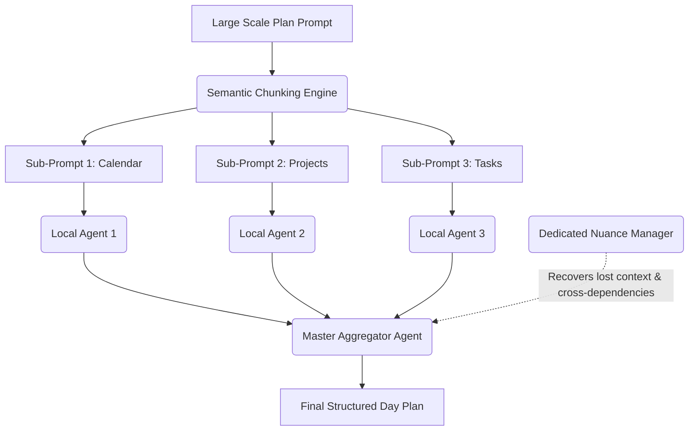

# Project Zora

<p align="center">
  
</p>

Project Zora is a local-first, Starfleet-themed personal assistant and daily dashboard inspired by the USS Discovery's onboard AI. It consolidates your calendar, tasks, and project streams into a single interactive view, scheduling your day into structured morning, afternoon, and evening blocks.

---

## The Technical Thesis: Small Models, Large-Scale Thinking

Anyone can build a personal planner by throwing giant, expensive, cloud-hosted APIs (like GPT-4 or Claude 3.5 Sonnet) at the problem. The core engineering thesis of Project Zora is different: **Can we coordinate small, local, open-source models to achieve the long-horizon, large-scale reasoning and planning usually reserved for frontier models?**

By orchestrating lightweight models running entirely on local consumer hardware, Zora delivers a personalized scheduler that is zero-cost, private, zero-latency, and capable of self-directed rule learning.

---

## Historical Iterations

Getting highly structured daily planning and self-evolution out of small models required moving away from simple single-prompt architectures. The project progressed through several distinct phases:

1. **Model Exploration:** Testing numerous open-weight architectures to balance fast execution, deep reasoning (DeepSeek-R1), and strict, deterministic JSON parsing (Qwen 2.5).
2. **Memory Architectures:** Moving from flat state files to a structured multi-tier memory system—including a localized whiteboard cache, a dynamic names registry, and active contextual databases.
3. **Task Deconstruction:** Transitioning away from monolithic planning prompts (which caused small models to hallucinate or drop events) toward multi-step pipelines where calendar synchronization, project step-tracking, and task loading are isolated into separate reasoning passes.
4. **Custom Integrations:** Designing customized communication pipelines (such as our SSE-based telemetry stream at `/stream`) to monitor the model's live thinking blocks and internal states.

---

## Current Architecture: How It Works Today

Zora currently runs a production-grade, local dual-LLM system:

- **Dual-LLM Planning Pipeline:** Uses `deepseek-r1:7b` for deep, unconstrained logical reasoning, coupled with `qwen2.5:3b` as a fast, high-fidelity JSON parser.
- **Closed-Loop Rule Evolution:** When you manually adjust today's plan in the dashboard, Zora doesn't just save the change—it learns from it. A local reflection loop uses DeepSeek to analyze your edit's rationale, Qwen to extract precise diffs (add/remove/replace), verifies those diffs against `/context/rules.md` and `/context/planning.md`, and permanently updates your rules. If verification fails, the system enters a multi-turn clarification loop until the change is safely applied.
- **SSE Telemetry Feed:** Real-time thinking blocks (`<think>` tags) and planner states are streamed live from the backend to the UI over Server-Sent Events, making Zora's inner workings entirely transparent.

---

## The Next Frontier: The "Nuance Manager"

To scale past the prompt window and cognitive limitations of 3B–7B models, Zora is introducing a **Hierarchical Prompt Decomposition System**:



### How the Decomposition Works:
1. **Semantic Chunking:** A massive, multi-variable planning prompt is split into smaller, independent sub-prompts.
2. **Parallel Local Execution:** Small, hyper-specialized local agents process each chunk concurrently, avoiding context overload and memory degradation.
3. **Master Aggregation:** A master agent collects the outputs from the sub-agents and synthesizes them into a unified day plan.
4. **The Nuance Manager:** A dedicated process running side-by-side with the aggregator. Its sole responsibility is to track, recover, and inject back the subtle cross-dependencies, contextual signals, and time constraints that are naturally lost or ignored during the prompt chunking and aggregation steps.

---

## Getting Started

### Prerequisites

- Node.js (v18+)
- [Ollama](https://ollama.com/) running locally

### Installation

1. Clone the repository:
   ```bash
   git clone https://github.com/BlahBlah23406/project-zora.git
   cd project-zora
   ```
2. Install dependencies:
   ```bash
   npm install
   ```
3. Set up your environment variables:
   ```bash
   cp .env.example .env
   ```
   *(Configure your local model tags and ports inside `.env`)*

### Running the App

Start the development server:
```bash
npm run dev
```

Open [http://localhost:3000](http://localhost:3000) in your browser. Live LLM execution logs and reasoning can be monitored at [http://localhost:3000/stream](http://localhost:3000/stream).
