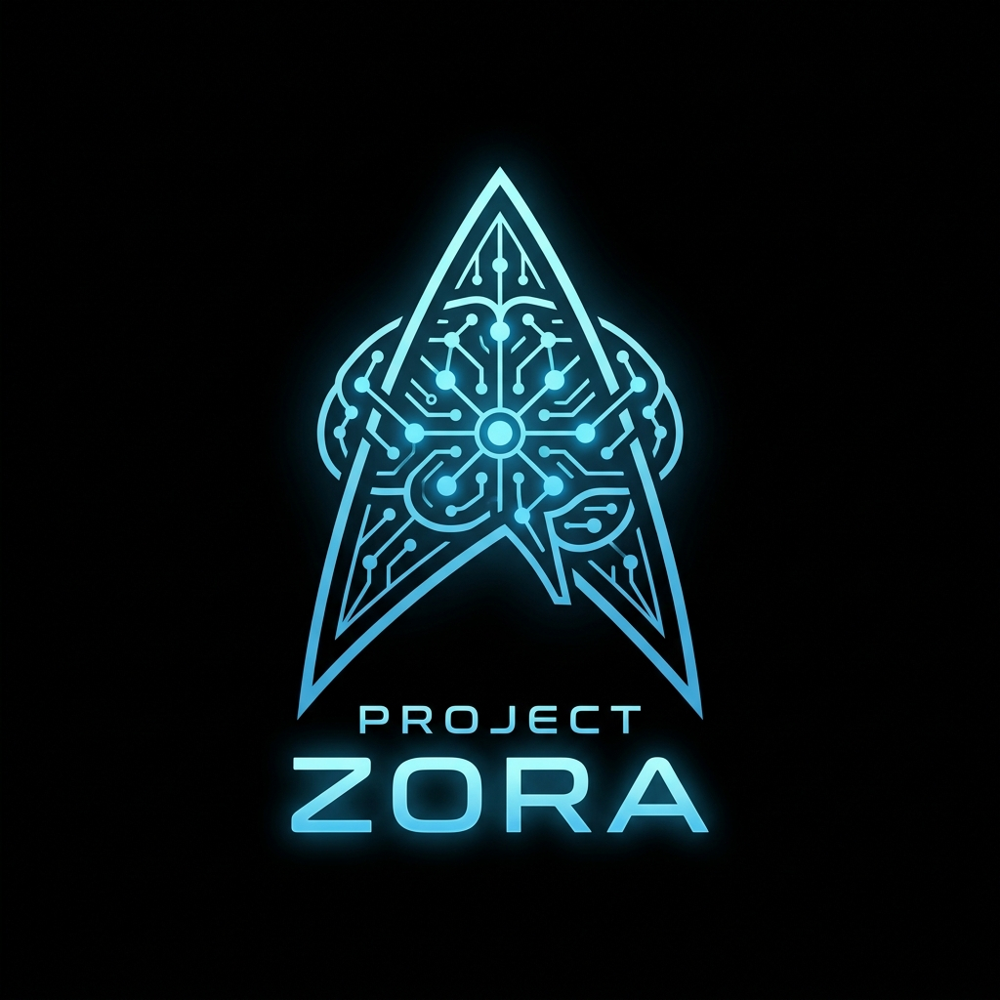

# Project Zora

<p align="center">
  
</p>

Project Zora is a Starfleet-themed personal assistant and daily dashboard inspired by the USS Discovery's onboard AI. It consolidates your calendar, tasks, and project streams into a single local-first view, helping you organize your days into morning, afternoon, and evening blocks.

## What It Does

- **Unified Dashboard:** Shows your calendar events, current project steps, and small daily tasks side-by-side.
- **Local AI Planning:** Uses local LLMs (via Ollama) to coordinate your schedule, write daily suggestions, and dynamically update your calendar and whiteboard plans.
- **Starfield Interface:** A visual dashboard with a live-rendering starfield background, quick task editing, and keyboard support.
- **End-of-Day Logs:** Review project progress, rate your day, write journal entries, and reset the schedule for the next morning.
- **Telemetry Stream:** A live SSE endpoint (`/stream`) that lets you watch the AI's prompts, responses, and internal reasoning in real-time.

## Getting Started

### Prerequisites

- Node.js (v18+)
- [Ollama](https://ollama.com/) running locally for AI planning features

### Installation

1. Clone this repository (or copy the files locally).
2. Install dependencies:
   ```bash
   npm install
   ```
3. Set up your environment variables:
   ```bash
   cp .env.example .env
   ```
   *Note: Edit `.env` to configure your preferred Ollama models, paths, and optional ports.*

### Running the App

Start the development server:
```bash
npm run dev
```

Open [http://localhost:3000](http://localhost:3000) in your browser. You can also view the live thinking/event stream at [http://localhost:3000/stream](http://localhost:3000/stream).

## Structure

- `/backend`: The Express server, planners, calendar/task managers, and local memory managers.
- `/frontend`: The HTML, CSS (starfield canvas & Starfleet theme), and client-side application logic.
- `/context`: Stores local JSON databases for events, tasks, names, and rules.
